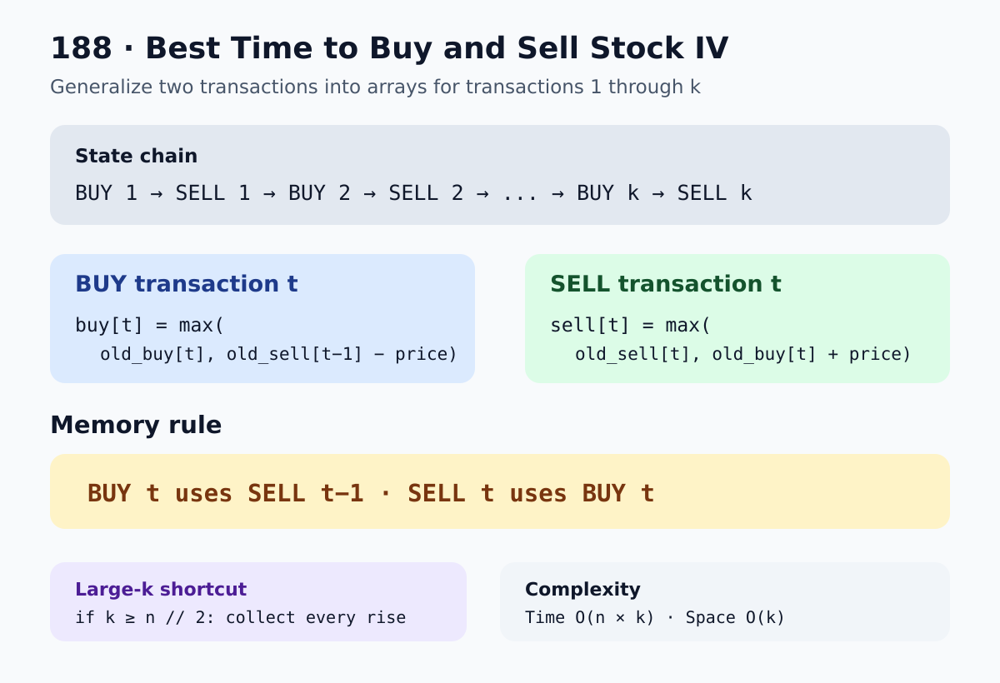

# 188. Best Time to Buy and Sell Stock IV

[LeetCode problem](https://leetcode.com/problems/best-time-to-buy-and-sell-stock-iv/description/)

You are given an array `prices`, where `prices[i]` is the stock price on day `i`, and an integer `k`.

Return the maximum profit possible using at most `k` transactions. One transaction consists of buying once and selling later. A stock must be sold before another stock can be bought.

## Examples

### Example 1

```text
Input: k = 2, prices = [2, 4, 1]
Output: 2
Explanation: Buy at 2 and sell at 4.
```

### Example 2

```text
Input: k = 2, prices = [3, 2, 6, 5, 0, 3]
Output: 7
Explanation:
  Transaction 1: Buy at 2 and sell at 6. Profit = 4.
  Transaction 2: Buy at 0 and sell at 3. Profit = 3.
  Total profit = 7.
```

## Intuition

The two-transaction problem uses four states:

```text
buy1 -> sell1 -> buy2 -> sell2
```

For `k` transactions, put those states into arrays:

```text
buy[1], sell[1], buy[2], sell[2], ..., buy[k], sell[k]
```

- `buy[t]` is the best value after starting transaction `t` and currently holding a stock.
- `sell[t]` is the best profit after completing at most `t` transactions and holding no stock.

To start transaction `t`, transaction `t - 1` must already be complete:

```text
buy[t] = max(buy[t], sell[t - 1] - price)
```

To complete transaction `t`, sell the stock held by `buy[t]`:

```text
sell[t] = max(sell[t], buy[t] + price)
```

The arrays can be updated in place from transaction `1` through `k`. This may
finish transaction `t - 1` and start transaction `t` on the same day, but both
actions use the same price, so they add zero profit and cannot inflate the answer.

The pattern to remember is:

```text
BUY t uses SELL t-1
SELL t uses BUY t
```



## Optimization for a large `k`

Every complete transaction needs at least two days: one day to buy and another day to sell. Therefore, no more than `n // 2` transactions are possible.

When `k >= n // 2`, the transaction limit is effectively unlimited. In that case, collect every positive increase between consecutive days.

## Solution

```python
class Solution:
    def maxProfit(self, k: int, prices: list[int]) -> int:
        n = len(prices)

        if n == 0 or k == 0:
            return 0

        if k >= n // 2:
            return sum(
                max(0, prices[day] - prices[day - 1])
                for day in range(1, n)
            )

        buy = [float("-inf")] * (k + 1)
        sell = [0] * (k + 1)

        for price in prices:
            for transaction in range(1, k + 1):
                buy[transaction] = max(
                    buy[transaction],
                    sell[transaction - 1] - price,
                )

                sell[transaction] = max(
                    sell[transaction],
                    buy[transaction] + price,
                )

        return sell[k]
```

## Why this is the best solution

A brute-force solution tries different combinations of buying and selling days and becomes impractical as `n` and `k` increase.

Dynamic programming keeps only the best holding and selling result for each transaction count. Each price is processed once for each transaction number.

The unlimited-transactions shortcut prevents unnecessary `O(n * k)` work when `k` is large.

## Complexity

When `k < n // 2`:

- Time: `O(n * k)`
- Space: `O(k)`

When `k >= n // 2`:

- Time: `O(n)`
- Space: `O(1)` excluding generator evaluation

## Edge cases

- No prices or `k = 0`: return `0`.
- Prices always decrease: return `0`.
- Only one profitable transaction exists: unused transactions are allowed.
- `k` is larger than the number of possible transactions: use the unlimited-transactions optimization.
