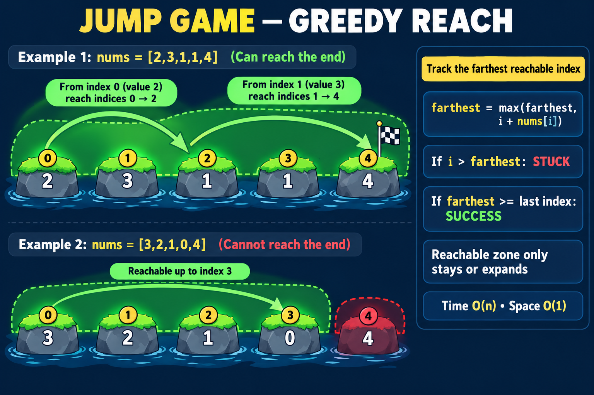

# 55. Jump Game

[LeetCode problem](https://leetcode.com/problems/jump-game/)

You start at index `0`. Each value `nums[i]` is the maximum distance you may
jump from that index. Return `True` when the final index is reachable.

## Intuition

We do not need to construct the exact sequence of jumps. We only need to know
the boundary of the reachable area:

```text
farthest = farthest index reachable so far
```

When index `i` is reachable, it can extend that boundary to `i + nums[i]`:

```text
farthest = max(farthest, i + nums[i])
```

The reachable area can stay the same or expand; it never shrinks.

- If `i > farthest`, we cannot reach `i`, so there is no way to continue.
- If `farthest >= len(nums) - 1`, the final index is reachable.



## Example 1: reachable

```text
nums = [2, 3, 1, 1, 4]

index 0: farthest = max(0, 0 + 2) = 2
index 1: farthest = max(2, 1 + 3) = 4

4 is the final index, so return True.
```

We did not choose one exact jump. We examined every index inside the reachable
area and retained the farthest boundary.

## Example 2: blocked

```text
nums = [3, 2, 1, 0, 4]

index 0: farthest = 3
index 1: farthest = 3
index 2: farthest = 3
index 3: farthest = 3
index 4: 4 > farthest

Index 4 is unreachable, so return False.
```

The zero is not automatically a failure. It is a failure only when the
reachable boundary cannot jump over it. For example, `[2, 0, 1]` returns
`True` because index `0` reaches index `2` directly.

## Pseudocode

```text
farthest = 0

for every index i:
    if i is beyond farthest:
        return False

    farthest = maximum of:
        old farthest
        i + nums[i]

    if farthest reaches the last index:
        return True

return True
```

## Solution

```python
class Solution:
    def canJump(self, nums: list[int]) -> bool:
        farthest = 0

        for index, jump_length in enumerate(nums):
            if index > farthest:
                return False

            farthest = max(farthest, index + jump_length)

            if farthest >= len(nums) - 1:
                return True

        return True
```

## Why greedy works

Assume every index from `0` through `farthest` is reachable. We examine each
of those indices and keep the greatest boundary any of them can produce. The
exact path does not matter: a larger reachable boundary contains every choice
offered by a smaller boundary.

If the next index is greater than `farthest`, none of the previously reachable
positions could cross that gap. Therefore, returning `False` is safe.

## Complexity

- Time: `O(n)` because each index is processed at most once.
- Space: `O(1)` because only `farthest` is stored.

## Edge cases

- One element, such as `[0]`: already at the destination, so return `True`.
- A zero that can be skipped, such as `[2, 0, 1]`: return `True`.
- A blocking zero, such as `[1, 0, 1]`: return `False`.
- All zeros with more than one element: return `False`.
- A first jump that reaches beyond the end: return `True`.

## Interview summary

> Track the farthest reachable index. If the current index is beyond it, the
> index is unreachable. Otherwise, expand the boundary using `i + nums[i]`.
> Once the boundary reaches the final index, return `True`.
