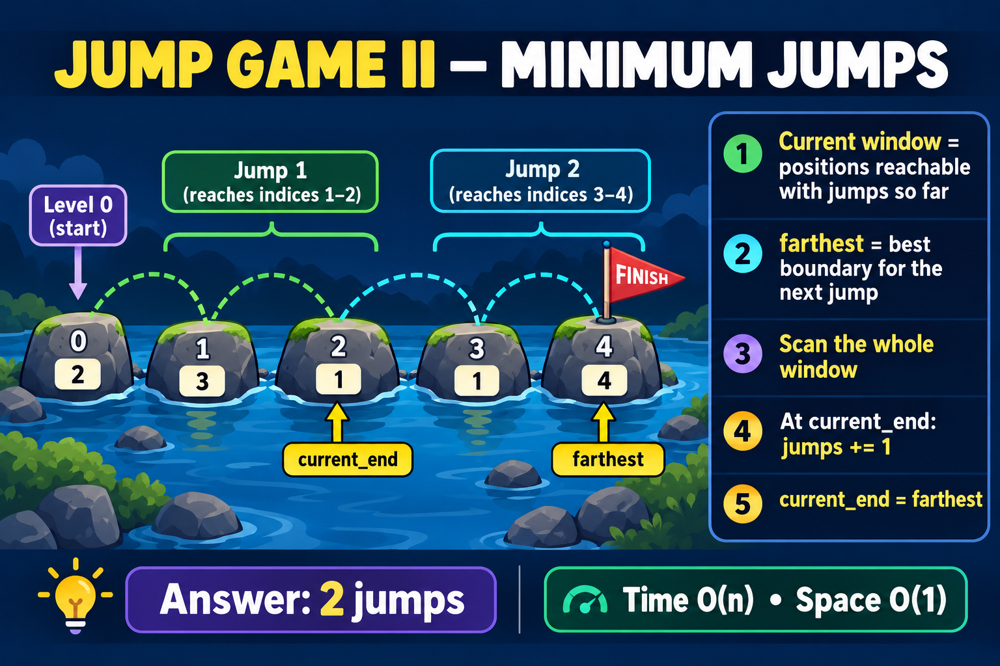

# 45. Jump Game II

[LeetCode problem](https://leetcode.com/problems/jump-game-ii/)

You start at index `0`. Each value `nums[i]` is the maximum distance you may
jump from that index. Return the minimum number of jumps needed to reach the
final index. The problem guarantees that the final index is reachable.

## Relationship to Jump Game I

- Jump Game I asks whether the final index is reachable and tracks only
  `farthest`.
- Jump Game II asks for the minimum jumps, so it tracks both the current
  reachable window and the best boundary for the next window.

## Intuition: treat reachable positions as BFS levels

All indices reachable with the same number of jumps form one window:

```text
current window -> every position reachable with the jumps counted so far
next window    -> every position reachable after one additional jump
```

Use three variables:

- `jumps`: number of jumps committed so far.
- `current_end`: end of the current window.
- `farthest`: farthest boundary that the next jump could reach.

Scan every index in the current window and calculate:

```text
farthest = max(farthest, index + nums[index])
```

When `index == current_end`, the entire current window has been examined. We
must enter the next level:

```text
jumps += 1
current_end = farthest
```



## Walkthrough

```text
nums  = [2, 3, 1, 1, 4]
index    0  1  2  3  4
```

Initially:

```text
jumps = 0, current_end = 0, farthest = 0
```

At index `0`:

```text
farthest = max(0, 0 + 2) = 2
index == current_end, so:
    jumps = 1
    current_end = 2
```

Indices `1` and `2` are the complete window reachable with one jump. Examine
both before choosing the next boundary:

```text
index 1: farthest = max(2, 1 + 3) = 4
index 2: farthest = max(4, 2 + 1) = 4
```

At index `2`, the current window ends:

```text
jumps = 2
current_end = 4
```

The final index is now inside the reachable window, so the answer is `2`.

## Pseudocode

```text
jumps = 0
current_end = 0
farthest = 0

for every index before the final index:
    farthest = max(farthest, index + nums[index])

    if index reaches current_end:
        jumps += 1
        current_end = farthest

return jumps
```

## Solution

```python
class Solution:
    def jump(self, nums: list[int]) -> int:
        jumps = 0
        current_end = 0
        farthest = 0

        for index in range(len(nums) - 1):
            farthest = max(farthest, index + nums[index])

            if index == current_end:
                jumps += 1
                current_end = farthest

        return jumps
```

## Why greedy is optimal

Every index inside the current window needs the same number of jumps to reach.
We inspect all of them and retain the farthest boundary obtainable with one
additional jump. A farther boundary includes every future position offered by
a shorter boundary, so keeping only the farthest one cannot discard a better
answer.

We increase `jumps` only after the complete current window has been scanned.
That is why scanning several indices does not count as several jumps.

## Why stop before the final index?

The loop uses:

```python
range(len(nums) - 1)
```

Once the final index is reached, no additional jump is necessary. Processing
it could incorrectly increment `jumps` one more time.

For `[0]`, the loop is empty and the answer is correctly `0`.

## Complexity

- Time: `O(n)` because every relevant index is processed once.
- Space: `O(1)` because only three variables are maintained.

## Edge cases

- `[0]`: already at the destination, so return `0`.
- `[1, 0]`: one jump reaches the destination.
- `[2, 3, 1, 1, 4]`: return `2`.
- `[2, 3, 0, 1, 4]`: return `2`.
- A large first value that reaches the end: return `1`.

## Interview summary

> Treat reachable indices as BFS levels. `current_end` is the boundary of the
> current level, while `farthest` builds the next level. After scanning the
> whole current window, count one jump and move `current_end` to `farthest`.
